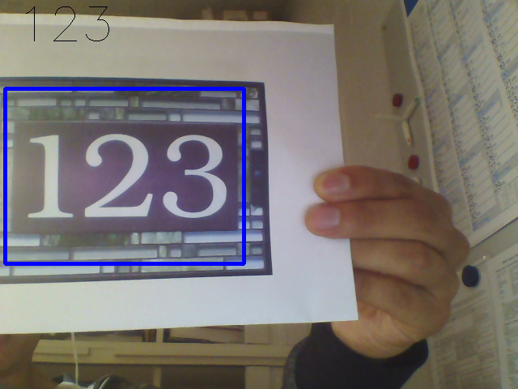

# Deep Learning Capstone Project
## Udacity - Machine Learning Nanodegree - Capstone Project 

This is my capstone project for the Udacity Machine Learning Nanodegree. I implemented an application which detects, localizes and interprets number strings in real-world images.

A [report](https://github.com/camigord/ML_CapstoneProject/blob/master/Capstone%20Project.pdf) describing the development of the current project can be found together with the code.

I used [TensorFlow](https://www.tensorflow.org/) to train the model, and [OpenCV](http://opencv.org/) to capture webcam frames.

All the code was implemented as Jupyter Notebooks (Python 2.7). The following is a description of each one of the available files:

- *1_CreateSyntheticData.ipynb:* 
> Generates Synthetic training samples by concatenating digits from the [MNIST](http://yann.lecun.com/exdb/mnist/) dataset. The code assumes that TensorFlow is installed and loads the data from its tutorials.

- *2_TrainSyntheticModel.ipynb*
> Trains an initial and very simple convolutional model using the previously generated synthetic images.

- *3_Preprocess_SVHN.ipynb*
> Downloads, extracts and preprocess the [SVHN](http://ufldl.stanford.edu/housenumbers/) dataset in order to generate a more real and challenging training dataset. All the preprocessing steps are described in the [report file](https://github.com/camigord/ML_CapstoneProject/blob/master/Capstone%20Project.pdf).

- *4_TrainingOnSVHN.ipynb*
> Defines and trains the model architecture used to decode sequences of digits from input images. It employes the datasets generated by the previous script.

- *5_Generate_Regression_Datasets.ipynb*
> We train an additional regression model to detect and localize the number strings within the original image. This file uses some of the results from the *3_Preprocess_SVHN* file and generates a training dataset which allow us to identify the bounding box surrounding the numbers. 

- *6_Train_Regression_Model.ipynb*
> Defines and trains the regression model which outputs the coordinates of the bounding box surrounding the numbers in the image (if any). It employes the datasets generated by the previous script.

- *7_Evaluate_Models.ipynb*
> Finally, this script loads both models and uses OpenCV to capture frames from a WebCam and test the performance of the proposed approach on those images. OpenCV and its video codecs are requied to capture camera frames.

